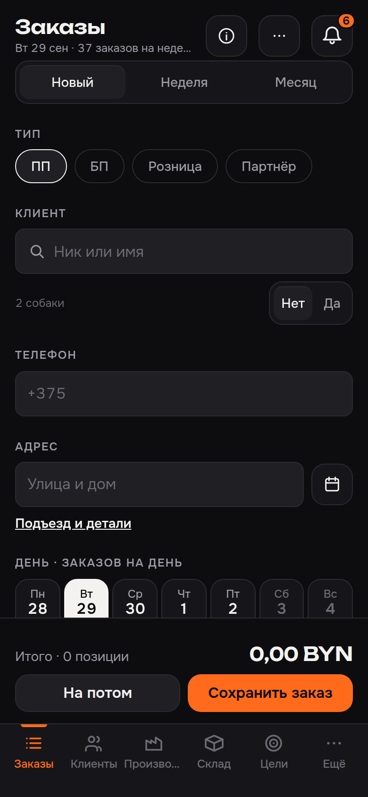
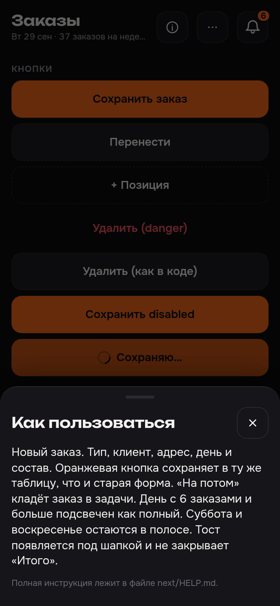
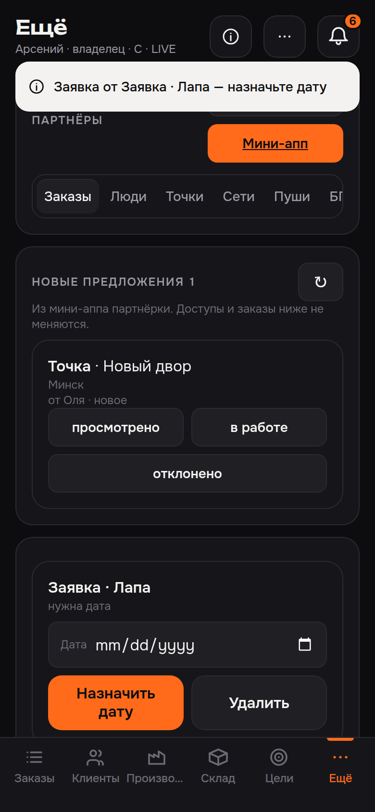
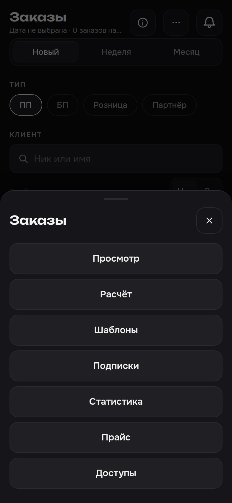

# Аудит 2. Читаемость и доступность

Вердикт: основной текст и оранжевая кнопка читаются (17.35:1 и 6.81:1). Всё второстепенное — нет. Граница вторичной кнопки и поля **1.36:1** при пороге 3:1, серый `--b-text-3` **3.12–3.69:1** при пороге 4.5:1. Светлая и тёмная темы Telegram дают один и тот же тёмный экран: `--tg-theme-*` нигде не читаются.

Замер: `next.html`, viewport 390×844, Playwright `colorScheme: light` и `dark`. Контраст — WCAG 2.2 (относительная яркость). Обычный текст ≥ 4.5:1. Крупный (≥ 24px или ≥ 18.66px при `font-weight` ≥ 700) и границы UI ≥ 3:1. Кегль 20px при весе 600 крупным не считается.

Роли сверены с `boinya-c/next/access.js` (строки 7–17) и `app.js`. Отдельной роли «партнёр» нет: кабинет — экран «Партнёры» у owner, all и manager.

## Тема Telegram

| Проверка | Светлая | Тёмная |
|---|---|---|
| `--b-bg` / `--b-text` на экране «Заказы» | `#0d0d0f` / `#f3f2f0` | те же |
| SHA-256 скрина заказов | `993e2f5edbe6…` = `43-orders-new-telegram-light.png` | = `01-orders-new-owner.png` |
| Нарезка и ширма «Ожидание» | пиксель в пиксель с тёмными `44` и `45` | `14`, `32` |

Причина: `boinya-c/next.html:6` фиксирует `<meta name="color-scheme" content="dark">`. Палитра зашита в `boinya-c/ds.css:8-21`. В `ds.css`, `next/app.css` и `next/*.js` нет `--tg-theme-*` и нет `prefers-color-scheme`.

Ниже две таблицы. Первая — то, что реально на экране (одинаково в обеих темах). Вторая — типичные значения `--tg-theme-*` (iOS day / iOS night). Их нельзя подставить как есть: hint и текст кнопки сами не проходят AA.

## Контраст фактических пар (`--b-*`)

Порог в колонке «норма». «Крупный» здесь не применяется: самый мелкий провал — 12px, даты выходных — 16px/600.

| Пара | Где | Фон | Текст / заливка | Контраст | Норма | |
|---|---|---|---|---|---|---|
| text / bg | тело, заголовок | `#0d0d0f` | `#f3f2f0` | **17.35** | 4.5 | ок |
| text / surface | карточка, лист | `#16161a` | `#f3f2f0` | **16.13** | 4.5 | ок |
| text / surface-2 | поле, сегмент «вкл» | `#1f1f24` | `#f3f2f0` | **14.67** | 4.5 | ок |
| text-2 / bg | подзаголовок, `.b-lbl` | `#0d0d0f` | `#9b9aa3` | **6.98** | 4.5 | ок |
| text-2 / surface | невыбранный сегмент | `#16161a` | `#9b9aa3` | **6.48** | 4.5 | ок |
| text-2 / surface-2 | чип «вкл», счётчик | `#1f1f24` | `#9b9aa3` | **5.90** | 4.5 | ок |
| text-3 / bg | `.b-note`, `.b-mark`, чип-счётчик | `#0d0d0f` | `#6c6b74` | **3.69** | 4.5 | нет |
| text-3 / surface | вкладки, выходные, примечания в карточке | `#16161a` | `#6c6b74` | **3.43** | 4.5 | нет |
| text-3 / surface-2 | placeholder, подпись поля | `#1f1f24` | `#6c6b74` | **3.12** | 4.5 | нет |
| bg на accent | `.b-btn--main`, бейдж | `#ff6b1a` | `#0d0d0f` | **6.81** | 4.5 | ок |
| accent / surface | активная вкладка | `#16161a` | `#ff6b1a` | **6.33** | 4.5 | ок |
| bad / bg | `.b-btn--danger` (в экранах не стоит) | `#0d0d0f` | `#ff5566` | **6.23** | 4.5 | ок |
| bad / surface | «−1» дефицита | `#16161a` | `#ff5566` | **5.79** | 4.5 | ок |
| warn / surface | число «полного» дня | `#16161a` | `#ffb547` | **10.27** | 4.5 | ок |
| ok / surface | пилюля «в норме», если включить | `#16161a` | `#3dd68c` | **9.62** | 4.5 | ок |
| info / surface | пилюля | `#16161a` | `#aeb6ff` | **9.40** | 4.5 | ок |
| выбранный день | дети `.b-day--on` | `#f3f2f0` | `#0d0d0f` | **17.35** | 4.5 | ок |
| тост | `.b-toast` | `#f3f2f0` | `#0d0d0f` | **17.35** | 4.5 | ок |
| line / bg | рамка кнопки и дока | `#0d0d0f` | `#2a2a31` | **1.36** | 3 | нет |
| line / surface | рамка карточки | `#16161a` | `#2a2a31` | **1.27** | 3 | нет |
| line / surface-2 | рамка поля | `#1f1f24` | `#2a2a31` | **1.15** | 3 | нет |
| surface-2 / bg | заливка secondary | `#0d0d0f` | `#1f1f24` | **1.18** | 3 | нет |
| surface / bg | карточка к фону | `#0d0d0f` | `#16161a` | **1.08** | 3 | нет |
| фокус | `outline` 2px | `#0d0d0f` | `#f3f2f0` | **17.35** | 3 | ок |

Пилюли `ds.css:513-531` на тёмной карточке (текст цвета статуса на смеси 13% этого цвета и `#16161a`): ok 7.54, bad 4.97, warn 7.90, info 7.17. На экранах next пилюли не используются. На белом те же яркие цвета провалятся — в светлой палитре ниже они темнее.

Колонка кнопки «Сохраняю…» (`opacity: 0.8`, `ds.css:810-812`): тёмный текст на приглушённом оранжевом **4.68:1** — ещё проходит. Обычный `:disabled` цвет не меняет (`ds.css:805-808`).

## Если подставить `--tg-theme-*` как есть

Светлая (day): bg `#ffffff`, text `#000000`, hint `#8e8e93`, button `#2481cc`, button-text `#ffffff`, destructive `#ff3b30`, separator `#c8c7cc`.

| Пара | Контраст | Норма | |
|---|---|---|---|
| text / bg | 21.00 | 4.5 | ок |
| hint / bg | **3.26** | 4.5 | нет |
| hint / secondary `#efeff3` | **2.84** | 4.5 | нет |
| button-text / button | **4.13** | 4.5 | нет |
| link `#2481cc` / bg | **4.13** | 4.5 | нет |
| destructive / bg | **3.55** | 4.5 | нет |
| separator / bg | **1.68** | 3 | нет |

Тёмная (night): bg `#1c1c1d`, secondary `#2c2c2e`, text `#ffffff`, hint `#98989d`, button `#62aef7`, button-text `#ffffff`, destructive `#ff453a`.

| Пара | Контраст | Норма | |
|---|---|---|---|
| text / bg | 17.03 | 4.5 | ок |
| hint / bg | 5.93 | 4.5 | ок |
| hint / secondary | 4.85 | 4.5 | ок |
| button-text / button | **2.36** | 4.5 | нет |
| destructive / bg | 5.00 | 4.5 | ок |
| separator `#3a3a3c` / secondary | **1.23** | 3 | нет |

Вывод: следовать Telegram можно только для фона и основного текста. Hint, кнопку и «опасный» цвет задавать своими токенами.

## Кнопки, фокус, шрифт, касание

Четыре вида в `ds.css:773-794`: main (оранжевый, читается), sec (заливка 1.18:1, рамка 1.36:1), dash (прозрачный, та же рамка), danger (красный текст 6.23:1 — класс есть, в `next/*.js` не стоит).

«Сохранить заказ» и «На потом» лежат в `.nx-actions` (`orders.js:480`). Правило `app.css:278` ставит кнопке `min-height: 40px` вместо 52px. Замер: **175×40**.

Фокус с клавиатуры есть: у «Справка» `outline: 2px solid #f3f2f0`, offset 2px (`ds.css:814-817`, скрин `40-focus-help.png`). Лист `role="dialog"` (`shell.js:296`) фокус не забирает и Tab не держит: после открытия активна «Справка», через пять Tab фокус уходит на «Месяц» под шторой.

Шрифт (`ds.css:23-28`, тело `ds.css:62-64`): 12 / 14 / 16 / 20 / 28 px. Интерлиньяж тела и `.b-note` — 1.35 (12px → 16.2px). Заголовок списка 1.25, шапка 1.2, `.b-display` 1.15. Длинный заголовок шапки ужимается до 12px (`shell.js`, массив `sizes`).

Касание меньше 44×44 (замер на 390×844):

| Элемент | Размер | Где |
|---|---|---|
| `.b-seg__item` | высота 36, «БП» **36×36**, «Да» 34×36 | заказы, клиенты, нарезка, партнёры |
| `.b-chip` | высота 36, «!» **38×36** | тип заказа, нарезка |
| `.b-btn` в `.nx-actions`, `.b-btn--sm` | высота 40 | «Сохранить заказ», неделя, склад, статистика ‹ › **39×40** |
| день календаря `.nx-cal button` | **48×40** (`app.css:223`) | месяц |
| чекбокс нарезки / «платит себест» | **13×13** | нарезка, партнёры БП |
| `.nx-link`, телефон | высота 19 и **103×16** | заказ, маршрут |
| `.b-step__btn` | **36×38** (`ds.css` степпер) | состав заказа |
| шапка `.b-ib` | 44×44, в tight-режиме 36 (`app.css:46`) | обычно ок; бейдж «6» вылезает 46>42 |

Нижние вкладки по высоте ≥ 44. Подпись «Производство» обрезается: scrollWidth 84 при clientWidth 64 (`app.css` ellipsis). Дни полосы — высота 64, ширины хватает.

Статусы текстом, не только цветом: «активна» / «пауза» в клиентах, «Выложено» / «Нарезано», легенда «полный от 6». Только цветом или знаком: выходной (приглушение `--b-text-3`, `ds.css` `.b-day--off`), дефицит «−N» (`warehouse.js` цвет `--b-bad`), дельта статистики (`stats.js:41`, ok/bad без слова «рост»), полоска `.nx-bar` залита `--b-warn` (`app.css`). Выбранный сегмент: заливка surface-2 к surface **1.10:1**, смена текста text-2 → text **2.49:1** — состояние почти не видно. У сегментов нет `aria-pressed`, у вкладок нет `aria-current`. Календарь и кнопка «неделя» склада `aria-pressed` ставят.

## Находки

| Экран | Роль | Элемент | Проблема | | Что сделать |
|---|---|---|---|---|---|
| Все с кнопками sec/dash и полями | owner, manager, all, cutter, courier, logistics | `.b-btn--sec`, `.b-btn--dash`, `.b-field`, рамка дока | Рамка `#2a2a31` к фону **1.36:1**, заливка secondary **1.18:1**. Кнопка не отделяется от фона (`ds.css:13`, `ds.css:778-788`, `app.css:29`) | P0 | `--b-line: #747378` (4.13:1 к фону, 3.49:1 к surface-2) |
| Заказы, неделя, клиенты, склад, статистика, партнёры, ширмы | те же + pending/denied/none | `.b-note`, placeholder, `.b-mark` | `--b-text-3` **3.69 / 3.43 / 3.12** (`ds.css:16`, `ds.css:123-130`) | P1 | `--b-text-3: #8e8d92` (4.98:1 на surface-2) |
| Заказы → Новый | owner, manager, all | дни Сб/Вс | Число и буква `#6c6b74` на `#16161a` **3.43:1**, 16px (`ds.css` `.b-day--off`) | P1 | тот же text-3; у выходного оставить подпись «вых» |
| Нижняя панель | owner, manager, all | неактивная вкладка | Подпись 12px **3.43:1**; «Производство» обрезано 84/64 | P1 | text-3 + не резать подпись (двухстрочная или короче «Цех») |
| Заказы → Новый | owner, manager, all | «Сохранить заказ», «На потом» | **175×40** из-за `.nx-actions` (`orders.js:480`, `app.css:278`) | P1 | min-height 44, у main в доке оставить 52 |
| Заказы, клиенты, производство, партнёры | все рабочие | сегменты, чипы, «БП» 36×36, «Да/Нет» | высота 36 (`ds.css:298`, `ds.css:334`) | P1 | height 44 |
| Месяц | owner, manager, all | клетки календаря | **48×40** (`app.css:223`) | P1 | height 44 |
| Нарезка, партнёры → БП | owner, cutter, courier | чекбокс | **13×13** при подписи рядом | P1 | попадание по всей строке уже есть у `<label>`; сам квадрат ≥ 24, лучше 44 |
| Маршрут | owner, courier | телефон, «Раскрыть» | высота 16–19 | P1 | строка-кнопка min-height 44 |
| Статистика | owner, all | ‹ › месяца | **39×40** | P1 | 44×44 |
| Неделя, клиенты, шаблоны, партнёры | owner, manager, all | «Удалить» | класс `b-btn--sec`, как «Перенести» (`week.js:126`, `partners.js` `ph-del`). Подтверждение удаления — оранжевый main (`shell.js:353`) | P1 | `b-btn--danger` на удаление; в подтверждении danger, не main |
| Состояния, люди | owner | disabled / «Сохраняю…» | `:disabled` выглядит как обычная кнопка (`ds.css:805`) | P1 | opacity ~0.45 (для disabled контраст WCAG не требует) |
| Любой лист и справка | все | диалог | фокус не внутри, Tab уходит под штору (`shell.js:296`) | P1 | фокус на заголовок или «Закрыть», ловушка Tab, вернуть фокус на кнопку |
| Заказы / Производство | owner, manager, all | долгое нажатие вкладки | «Просмотр, Расчёт, Шаблоны, Подписки, Статистика, Прайс, Доступы» только по удержанию 480 мс (`app.js:205-218`). Клавиатуры нет | P1 | те же пункты в «Ещё» и с клавиатуры |
| Партнёры | owner, all, manager | «✕» у доступа | имя кнопки — символ, без `aria-label` (`partners.js` `ph-acc-x`) | P1 | `aria-label="Убрать доступ"` |
| Все | все роли Telegram | светлая тема | экран не меняется, `color-scheme=dark` | P1 | палитра ниже по `data-scheme`, не сырой hint/button |
| Статистика | owner, all | дельта и `.nx-bar` | рост/падение и доля только цветом (`stats.js:41`) | P2 | слово «рост» / «спад» рядом со знаком |
| Склад | owner, logistics | «−N» | красный минус без слова «дефицит» | P2 | текст «дефицит N» |
| Сегменты | все, кто их видит | выбранный пункт | заливка 1.10:1 к соседней, нет `aria-pressed` | P2 | рамка `--b-line` у `--on` и `aria-pressed` |
| Шапка, списки | все | 12px, line-height 1.35 и 1.25 | мелкий серый текст ещё и плотный | P2 | примечания 14px, line-height 1.45 |

Ширмы (скрин `32`–`36`): «Повторить» и «Запросить доступ» — main, контраст текста 6.81:1. Серый абзац под заголовком — text-2, **6.98:1**, он в порядке. У pending и denied кнопок нет.

Курьер и нарезчик без нижней панели (`28`, `29`). Склад логиста — тот же экран, что у владельца (`30`). Manager не видит статистику, прайс, доступы и цели; партнёров видит (`49`).

## Палитра

Тёмная — правка двух токенов и явный цвет текста на акценте. Остальные `--b-*` уже проходят AA, их не трогать.

```css
:root {
  --b-bg: #0d0d0f;
  --b-surface: #16161a;
  --b-surface-2: #1f1f24;
  --b-line: #747378;       /* было #2a2a31 */
  --b-text: #f3f2f0;
  --b-text-2: #9b9aa3;
  --b-text-3: #8e8d92;     /* было #6c6b74 */
  --b-accent: #ff6b1a;
  --b-on-accent: #0d0d0f;  /* текст main-кнопки, не через --b-bg */
  --b-ok: #3dd68c;
  --b-bad: #ff5566;
  --b-warn: #ffb547;
  --b-info: #aeb6ff;
}
```

| Пара после правки | Контраст |
|---|---|
| text-3 / bg, surface, surface-2 | 5.89, 5.48, **4.98** |
| line / bg, surface, surface-2 | **4.13**, 3.84, 3.49 |
| on-accent / accent | 6.81 |
| text-2 / surface-2 | 5.90 |

text-2 и новый text-3 различаются только на 1.18:1. Оба читаемы; иерархию держать кеглем и жирностью, не провалом серого.

Светлая — свои цвета, не hint Telegram. Включается на `documentElement.dataset.scheme = Telegram.WebApp.colorScheme`.

```css
:root[data-scheme="light"] {
  --b-bg: #f4f1ec;
  --b-surface: #ffffff;
  --b-surface-2: #efe6db;
  --b-line: #6f675f;
  --b-text: #1c1917;
  --b-text-2: #3f3a36;
  --b-text-3: #524c46;
  --b-accent: #c2410c;
  --b-on-accent: #ffffff;
  --b-ok: #0d6b3c;
  --b-bad: #b42336;
  --b-warn: #8a4b08;
  --b-info: #3730a3;
}
```

| Пара | Контраст |
|---|---|
| text / bg, surface, surface-2 | 15.52, 17.49, 14.17 |
| text-2 / bg, surface, surface-2 | 9.97, 11.23, 9.10 |
| text-3 / bg, surface, surface-2 | 7.51, 8.46, 6.86 |
| on-accent / accent | **5.18** |
| accent / surface | 5.18 |
| bad, warn, ok, info / bg | 5.76, 6.03, 5.85, 8.82 |
| line / bg, surface, surface-2 | 4.93, 5.55, 4.50 |

`.b-btn--main { color: var(--b-on-accent); }`. Если оставить `color: var(--b-bg)` в светлой теме, крем `#f4f1ec` на `#c2410c` даст только 4.60:1 — впритык, антиалиас съест запас.

## Топ-10

1. Рамки и заливка secondary/dash/полей **1.15–1.36:1** — кнопки сливаются с фоном. P0. Токен `--b-line: #747378`.
2. `--b-text-3` **3.12–3.69:1** на примечаниях, вкладках, выходных и placeholder. P1. `#8e8d92`.
3. Касания ниже 44: сегменты 36, чипы 36, «Сохранить заказ» 40, календарь 40, чекбокс 13, «БП» 36×36. P1.
4. «Удалить» рисуется как обычная вторичная или как оранжевое «Да». Класс danger не подключён. Disabled не отличается от обычной кнопки. P1.
5. Светлая тема Telegram не существует. Сырые hint и button-text Telegram сами не проходят 4.5:1. P1. Палитра `[data-scheme=light]` выше.
6. Диалог не забирает фокус, Tab уходит под штору. P1.
7. Кусок навигации (статистика, подписки, прайс) открывается только долгим нажатием. P1.
8. Подпись «Производство» в таббаре обрезана. P1.
9. Выходной, дефицит «−N», дельта статистики и полоска графика — в основном цвет. P2.
10. Интерлиньяж 1.15–1.35 и выбранный сегмент с заливкой 1.10:1. P2.

Что уже в порядке: основной текст 17.35:1, text-2 от 5.90:1, оранжевая кнопка 6.81:1, активная вкладка 6.33:1, кольцо фокуса, `lang="ru"`, подписи у иконок шапки, статусы клиентов словами.

## Скриншоты

Каталог `boinya-c/next/audit/img/a11y/`. Светлые `43`, `44`, `45` побайтово совпали с `01`, `14`, `32`.

| Файл | Экран | Роль |
|---|---|---|
| `01-orders-new-owner.png` | Заказы / Новый, верх | owner |
| `02-orders-new-owner-dock.png` | тот же, низ с кнопками | owner |
| `03-orders-week-owner.png` | Неделя | owner |
| `04-orders-month-owner.png` | Месяц | owner |
| `05-orders-month-day-owner.png` | Месяц, выбран день | owner |
| `07-tasks-owner.png` | Задачи | owner |
| `08-task-partner-owner.png` | Заявка партнёра | owner |
| `09-clients-lock-owner.png` | Клиенты, пароль | owner |
| `10-clients-pp-owner.png` | ПП | owner |
| `11-clients-card-owner.png` | Карточка | owner |
| `12-clients-calc-owner.png` | Расчёт | owner |
| `13-clients-pick-owner.png` | Подбор | owner |
| `14-cut-owner.png` | Нарезка | owner |
| `15-pack-owner.png` | Сборка | owner |
| `16-route-owner.png` | Маршрут | owner |
| `17-warehouse-owner.png` | Склад | owner |
| `18-warehouse-preview-owner.png` | Склад, план | owner |
| `19-goals-owner.png` | Цели, заглушка | owner |
| `20-more-owner.png` | Ещё | owner |
| `46-stats-owner.png` | Статистика | owner |
| `47-partners-owner.png` | Партнёры | owner |
| `48-partners-bp-owner.png` | Партнёры → БП | owner |
| `21-people-owner.png` | Доступы | owner |
| `22-templates-owner.png` | Шаблоны | owner |
| `23-price-owner.png` | Прайс | owner |
| `24-states-owner.png` | Пусто, ошибка, disabled | owner |
| `38-confirm-delete-owner.png` | Подтверждение удаления | owner |
| `40-focus-help.png` | Фокус на «Справка» | owner |
| `41-help-sheet.png` | Лист справки | owner |
| `42-component-gallery.png` | Все виды кнопок и пилюль | — |
| `51-nav-flyout-orders.png` | Долгое нажатие «Заказы» | owner |
| `25-orders-manager.png` | Заказы | manager |
| `26-calc-manager.png` | Расчёт | manager |
| `27-more-manager.png` | Ещё | manager |
| `49-more-manager-partners.png` | Ещё, пункт «Партнёры» | manager |
| `28-cutter.png` | Нарезка без панели | cutter |
| `29-courier.png` | Маршрут без панели | courier |
| `30-logistics.png` | Склад без панели | logistics |
| `31-role-all.png` | Заказы | all |
| `32-gate-pending.png` | Ожидание | pending |
| `33-gate-denied.png` | Доступ закрыт | denied |
| `34-gate-none.png` | Запросить доступ | none |
| `35-gate-offline.png` | Нет связи | none |
| `36-gate-outside.png` | Вне Telegram | none |
| `43-orders-new-telegram-light.png` | Заказы, светлая тема = тёмная | owner |
| `44-cut-telegram-light.png` | Нарезка, светлая = тёмная | owner |
| `45-gate-pending-telegram-light.png` | Ожидание, светлая = тёмная | pending |








